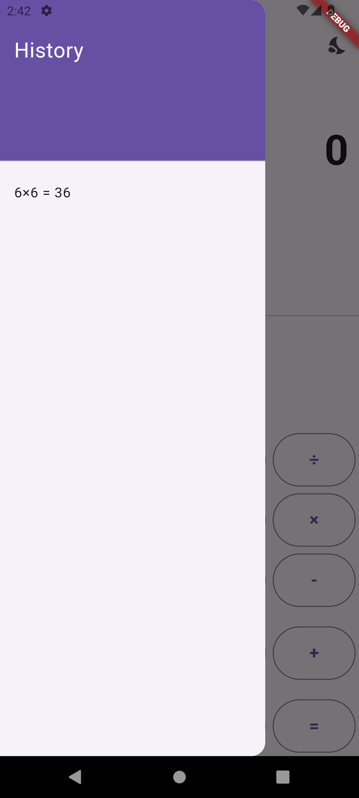

# Flutter Calculator

A basic calculator with them switch and history on Flutter.

## Screenshots

<p>
  
  
  
</p>

## Getting Started

To get started with this project, follow these steps:

### Prerequisites

Make sure you have the following installed:

- [Flutter SDK](https://flutter.dev/docs/get-started/install)
- [Dart SDK](https://dart.dev/get-dart)
- A compatible IDE (e.g., [Visual Studio Code](https://code.visualstudio.com/) or [Android Studio](https://developer.android.com/studio))

### Installation

1. Clone the repository:

   ```bash
   git clone https://github.com/Ramazanm1nd3R/base_calculator.git
